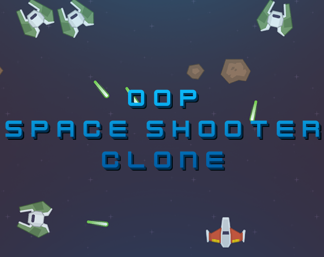

# OOP-SpaceShooter
This project was inspired by the classic space shooter games and developed as a demonstration of object-oriented programming techniques in Unity.

- [Itch.io](https://gr4ndsmurf.itch.io/oop-space-shooter-clone)

## Description

Space Shooter is a 2D space-themed game developed using Unity engine and C#. In this game, the player controls a spaceship and aims to destroy enemy ships. The player can collect power-ups to upgrade the ship and faces various levels of challenges.

The project demonstrates the use of Object-Oriented Programming (OOP) techniques to create a modular and maintainable game codebase. It utilizes several classes and inheritance to represent different entities in the game, such as Player Ship, Enemy Ship, Bullets, and Power-ups.

## Gameplay

- Use arrow keys or WASD to move the player ship.
- Press the Spacebar to shoot bullets and destroy enemy ships.
- Collect power-ups to gain health or increase ship speed.
- Avoid colliding with enemy ships and their bullets.
- Destroy as many enemy ships as possible to increase your score.

## OOP Techniques Used

### Class and Object

The game utilizes multiple classes, such as PlayerShip, EnemyShip, Bullet, PowerUp, and GameManager, to represent various entities and functionalities in the game.

### Inheritance

The PlayerShip and EnemyShip classes inherit from the abstract Ship class. This hierarchy allows sharing common attributes and behaviors between different types of ships.

### Abstract Classes

The Ship class is defined as an abstract class, providing a blueprint for the behavior and attributes of all ship types. It ensures consistency among derived classes.

### Polymorphism

The Move() and Shoot() methods are implemented differently in the PlayerShip and EnemyShip classes. This demonstrates the concept of polymorphism, where methods with the same name behave differently in different contexts.

### Encapsulation

The classes utilize encapsulation to hide the implementation details and provide a controlled interface to access or modify ship attributes and functionalities.

## Credits

- [Sprites](https://kenney.nl/assets/space-shooter-redux)
- [Audio](https://kenney.nl/assets/sci-fi-sounds)

